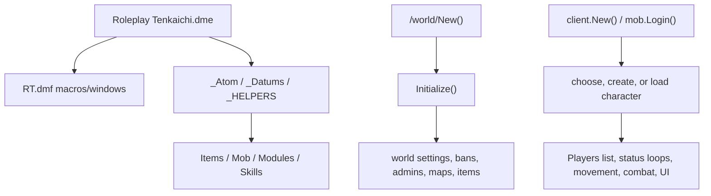

# Architecture

## Compilation and runtime shape

RPT-Classic is one ordered Dream Maker compilation unit. The DME first includes
`RT.dmf`, then shared atom/datum/helpers, items, maps, mobs, modules, and skills
(`Roleplay Tenkaichi.dme`, `BEGIN_INCLUDE` through `END_INCLUDE`). DM types are
open: later files extend or override earlier declarations.

## Startup and lifecycle

`/world/New()` in `Code/Modules/World/WorldSettings.dm:191` loads hub/activation
settings, calls the parent, opens logs, and asynchronously starts `Initialize()`,
environment repair, and `YearBook()`. `Initialize()` in
`Code/Modules/World/WorldSettings/WorldStarter.dm:1` loads serials, bans, admins,
scaling/year/gain/login/spawn settings; schedules map/item loading and save loops;
then starts day/announcement work and enables saving.

`mob/Login()` in `Code/Mob/LogInOut.dm:5` gates clients until maps/items are
ready, waits for character selection, attaches `/datum/mind`, and registers the
mob in global `Players`. `mob/Logout()` at line 141 clears transient state,
saves, removes the mob from `Players`, and deletes it unless a logged-out KO body
must remain temporarily.

## Principal type groups

- `/mob/player` is the configured world mob (`WorldSettings.dm:12`) and is
  extended throughout `Code/Mob`, character creation, combat, status, and UI.
- `/obj/items` is extended from `Code/Items/ObjectVars.dm` across item families.
- `/Skill`, `/Skill/Attacks`, and `/Skill/Buff` are based in
  `Code/Skills/!CombatSettings/Skills.dm:1,67,113` and specialized by tier/family.
- `/BodyPart` is based in `Code/Modules/HealthSystem/BodyParts.dm:1`.
- `/datum/mind` is defined in `Code/Modules/Mind/Mind.dm:1`.

## Shared state and coupling

`Code/Modules/World/WorldSettings.dm:16-187` owns many global toggles, caps,
spawn coordinates, lists, loading flags, and time values. `Players` is the
primary online-player list; many communication, admin, skill, and world procs
iterate it. Persistence serializes whole mobs and also maintains separate world,
map, item, area, ban, and admin savefiles. Interface code couples DM verbs and
procs to named DMF controls through `winset`, `winshow`, `output`, and `browse`.

## Extension points and dependencies

New content normally subclasses `/Skill` or `/obj/items`; new behavior extends
`mob`, `client`, `/world`, or shared atoms. Any new `.dm` must be included exactly
once at the correct point. Changes to `Login`, `Logout`, `Move`, `Read`, `Write`,
`Topic`, `New`, or `Del` require searching all declarations and parent calls.
